# Lab 5 lab return template 

Name ```LIEUTAUD Emy ```

Student ID ``` 2757995```

Participated in tasks ```1 to 4```

...

Name ```BECKER Norman ```

Student ID ```2756886 ```

Participated in tasks ```1 to 4 ```

Add all your group member's names and student IDs here. If you continue the tasks at home, you can work with different people. Please mark who participated in which tasks.

# Task 1
### Inspecting power differences of operations

Replace the following screenshot.

It should contain your custom power trace where you execute any amount of nops AND muls. You need to execute atleast 10 lines worth of each command and in total atleast 40 lines worth of assembly code. You are not required to execute the commands in 10 line chuncks and you can execute also any other assembly commands besides nop and mul.

Please have your screenshots roughly in the same scale as the placeholders. If your whole trace doesn't fit to that scale then you can of course take a larger picture.

Remember also add textual descriptions of images if they are needed.

#### Trace with your custom set of operations
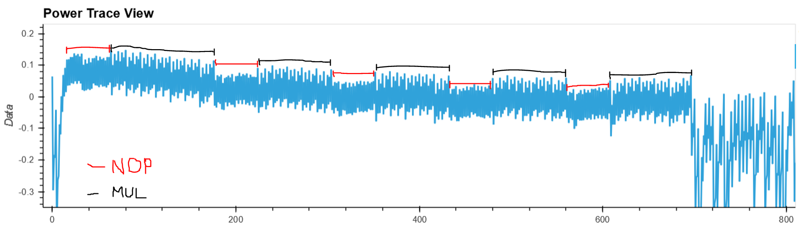
*The instruction is: 15 x NOP, 15 x MUL, 10 x NOP, 10 x MUL, 10 x NOP, 10 x MUL, 10 x NOP, 10 x MUL, 10 x NOP, 10 x MUL. At the beginning, the code starts to be executed (trigger_high function). Then, we can see the the sequence of instructions executed in the right order. The MUL requires more power than the NOP because multiplications are more complexe than no operation. After the instructions (around 700Pts), the specific code is ended (trigger_low function).*

### Breaking AES

**Paste the screenshot of solved key here**

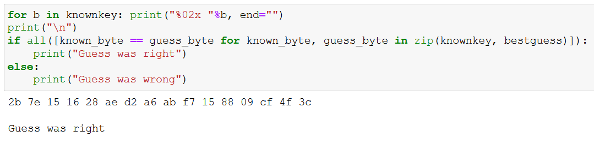

Explain how the correlation power analysis works. You may use questions given in task as template of your answer.
```
The correlation power analysis attack is an attack which allows the attacker to find a secret encryption key stored on a victim device.  
It can be done in 4 steps:  
- Capture the power traces: a loop will load some new plaintext and send the key and the plaintext to get the power traces. The convert traces will be stored to be analyzed.  
- Calculating correlation: a S-box (substitution box) is defined. It makes the link between the key and the plaintext. The Pearson correlation coefficient between the modeled and actual power consumption is calculated for each data point of the trace. Then, we function is defined to return the output of the S-box according to every single byte of input and every single byte of the guessed key. All the "1" bits will be counted.   
- Performing the check: all the subkeys with the biggest correlation will be kept. So they are the subkeys that best matche with data. Then, all the subkeys are assembled to form the solved key.   
A optional step can be added to check if the guess was right.  
It's important to ranking the output of the correlation equation to determine the most likely key, to be sure that the key that we found is the right.  
AES (Advanced Encryption Standard) is an algorithm that serves to encrypt electronic data. By sending plaintext and key, we can analyze the output because it uses a fixed box. The encryption will always stay the same.   
By doing a correlation between each byte of input and of the guessed key, we can take the maximum of correlation for each subkey.  
A subkey is calculated thanks to the Pearson correlation coefficient for a sample.   
In the numerator we have a difference between the guess for power consumption of the subkey of the trace number and the average guess for power consumption of the subkey multiplied by the difference between the trace of the sample point of the trace number and the average trace of the sample point, all in the sum for each trace number.   
Then, in the denominator, we have two sums for each trace number multiplied together under a square root.  
The first sum is the difference between the guess for power consumption of the subkey of the trace number and the average guess for power consumption of the subkey. This difference is squared.   
The second is the difference between the trace of the sample point of the trace number and the average trace of the sample point. This difference is squared too.   
Partial Guessing Entropy (PGE) determines the rank of the correct answer. The PGE increase when we don't use all possible traces. But our PGE is equal to 0 so we can say that our end result completely right.  
```

# Task 2

### Password bypass with power analysis

We just change the *checkpass* function:  
```python
def checkpass(trace, i):
        return trace[117 + 36 * i] < -0.2
```  
To find these numbers, we firstly tried with one letter and compared it with the *h*. We found an isolated green spike under -0.2 and we have retained its value.  
Then, we do the same but for the second letter (so the wrong password was the first letter right and the other wrong). We searched the same green spike and we also retained its value.  
We made a difference between these two and we did the same for the 3rd letter.  
We checked the difference to see if the previously calculated difference was correct.  
We then put the numbers into the function and managed to find the password.   

Screenshot after your script has correctly solved the password

<details>
  <summary>
WARNING:root:SAM3U Serial buffers OVERRUN - data loss has occurred.<br>  
WARNING:root:SAM3U Serial buffers OVERRUN - data loss has occurred.<br>
WARNING:root:SAM3U Serial buffers OVERRUN - data loss has occurred.<br>
WARNING:root:SAM3U Serial buffers OVERRUN - data loss has occurred.<br>
WARNING:root:SAM3U Serial buffers OVERRUN - data loss has occurred.<br>
WARNING:root:SAM3U Serial buffers OVERRUN - data loss has occurred.<br>
WARNING:root:SAM3U Serial buffers OVERRUN - data loss has occurred.<br>
WARNING:root:SAM3U Serial buffers OVERRUN - data loss has occurred.<br>
WARNING:root:SAM3U Serial buffers OVERRUN - data loss has occurred.<br>
Success, pass now h<br>
WARNING:root:SAM3U Serial buffers OVERRUN - data loss has occurred.<br>
WARNING:root:SAM3U Serial buffers OVERRUN - data loss has occurred.<br>
  </summary>
WARNING:root:SAM3U Serial buffers OVERRUN - data loss has occurred.<br>
WARNING:root:SAM3U Serial buffers OVERRUN - data loss has occurred.<br>
WARNING:root:SAM3U Serial buffers OVERRUN - data loss has occurred.<br>
WARNING:root:SAM3U Serial buffers OVERRUN - data loss has occurred.<br>
WARNING:root:SAM3U Serial buffers OVERRUN - data loss has occurred.<br>
WARNING:root:SAM3U Serial buffers OVERRUN - data loss has occurred.<br>
WARNING:root:SAM3U Serial buffers OVERRUN - data loss has occurred.<br>
WARNING:root:SAM3U Serial buffers OVERRUN - data loss has occurred.<br>
WARNING:root:SAM3U Serial buffers OVERRUN - data loss has occurred.<br>
WARNING:root:SAM3U Serial buffers OVERRUN - data loss has occurred.<br>
WARNING:root:SAM3U Serial buffers OVERRUN - data loss has occurred.<br>
WARNING:root:SAM3U Serial buffers OVERRUN - data loss has occurred.<br>
WARNING:root:SAM3U Serial buffers OVERRUN - data loss has occurred.<br>
WARNING:root:SAM3U Serial buffers OVERRUN - data loss has occurred.<br>
WARNING:root:SAM3U Serial buffers OVERRUN - data loss has occurred.<br>
WARNING:root:SAM3U Serial buffers OVERRUN - data loss has occurred.<br>
WARNING:root:SAM3U Serial buffers OVERRUN - data loss has occurred.<br>
WARNING:root:SAM3U Serial buffers OVERRUN - data loss has occurred.<br>
WARNING:root:SAM3U Serial buffers OVERRUN - data loss has occurred.<br>
WARNING:root:SAM3U Serial buffers OVERRUN - data loss has occurred.<br>
WARNING:root:SAM3U Serial buffers OVERRUN - data loss has occurred.<br>
WARNING:root:SAM3U Serial buffers OVERRUN - data loss has occurred.<br>
WARNING:root:SAM3U Serial buffers OVERRUN - data loss has occurred.<br>
WARNING:root:SAM3U Serial buffers OVERRUN - data loss has occurred.<br>
WARNING:root:SAM3U Serial buffers OVERRUN - data loss has occurred.<br>
Success, pass now h0<br>
WARNING:root:SAM3U Serial buffers OVERRUN - data loss has occurred.<br>
WARNING:root:SAM3U Serial buffers OVERRUN - data loss has occurred.<br>
WARNING:root:SAM3U Serial buffers OVERRUN - data loss has occurred.<br>
WARNING:root:SAM3U Serial buffers OVERRUN - data loss has occurred.<br>
WARNING:root:SAM3U Serial buffers OVERRUN - data loss has occurred.<br>
WARNING:root:SAM3U Serial buffers OVERRUN - data loss has occurred.<br>
WARNING:root:SAM3U Serial buffers OVERRUN - data loss has occurred.<br>
WARNING:root:SAM3U Serial buffers OVERRUN - data loss has occurred.<br>
WARNING:root:SAM3U Serial buffers OVERRUN - data loss has occurred.<br>
WARNING:root:SAM3U Serial buffers OVERRUN - data loss has occurred.<br>
WARNING:root:SAM3U Serial buffers OVERRUN - data loss has occurred.<br>
WARNING:root:SAM3U Serial buffers OVERRUN - data loss has occurred.<br>
WARNING:root:SAM3U Serial buffers OVERRUN - data loss has occurred.<br>
WARNING:root:SAM3U Serial buffers OVERRUN - data loss has occurred.<br>
WARNING:root:SAM3U Serial buffers OVERRUN - data loss has occurred.<br>
WARNING:root:SAM3U Serial buffers OVERRUN - data loss has occurred.<br>
Success, pass now h0p<br>
WARNING:root:SAM3U Serial buffers OVERRUN - data loss has occurred.<br>
WARNING:root:SAM3U Serial buffers OVERRUN - data loss has occurred.<br>
WARNING:root:SAM3U Serial buffers OVERRUN - data loss has occurred.<br>
WARNING:root:SAM3U Serial buffers OVERRUN - data loss has occurred.<br>
WARNING:root:SAM3U Serial buffers OVERRUN - data loss has occurred.<br>
WARNING:root:SAM3U Serial buffers OVERRUN - data loss has occurred.<br>
WARNING:root:SAM3U Serial buffers OVERRUN - data loss has occurred.<br>
WARNING:root:SAM3U Serial buffers OVERRUN - data loss has occurred.<br>
WARNING:root:SAM3U Serial buffers OVERRUN - data loss has occurred.<br>
WARNING:root:SAM3U Serial buffers OVERRUN - data loss has occurred.<br>
WARNING:root:SAM3U Serial buffers OVERRUN - data loss has occurred.<br>
WARNING:root:SAM3U Serial buffers OVERRUN - data loss has occurred.<br>
WARNING:root:SAM3U Serial buffers OVERRUN - data loss has occurred.<br>
WARNING:root:SAM3U Serial buffers OVERRUN - data loss has occurred.<br>
WARNING:root:SAM3U Serial buffers OVERRUN - data loss has occurred.<br>
WARNING:root:SAM3U Serial buffers OVERRUN - data loss has occurred.<br>
WARNING:root:SAM3U Serial buffers OVERRUN - data loss has occurred.<br>
WARNING:root:SAM3U Serial buffers OVERRUN - data loss has occurred.<br>
WARNING:root:SAM3U Serial buffers OVERRUN - data loss has occurred.<br>
WARNING:root:SAM3U Serial buffers OVERRUN - data loss has occurred.<br>
WARNING:root:SAM3U Serial buffers OVERRUN - data loss has occurred.<br>
WARNING:root:SAM3U Serial buffers OVERRUN - data loss has occurred.<br>
WARNING:root:SAM3U Serial buffers OVERRUN - data loss has occurred.<br>
WARNING:root:SAM3U Serial buffers OVERRUN - data loss has occurred.<br>
Success, pass now h0px<br>
WARNING:root:SAM3U Serial buffers OVERRUN - data loss has occurred.<br>
WARNING:root:SAM3U Serial buffers OVERRUN - data loss has occurred.<br>
WARNING:root:SAM3U Serial buffers OVERRUN - data loss has occurred.<br>
WARNING:root:SAM3U Serial buffers OVERRUN - data loss has occurred.<br>
WARNING:root:SAM3U Serial buffers OVERRUN - data loss has occurred.<br>
WARNING:root:SAM3U Serial buffers OVERRUN - data loss has occurred.<br>
WARNING:root:SAM3U Serial buffers OVERRUN - data loss has occurred.<br>
WARNING:root:SAM3U Serial buffers OVERRUN - data loss has occurred.<br>
WARNING:root:SAM3U Serial buffers OVERRUN - data loss has occurred.<br>
WARNING:root:SAM3U Serial buffers OVERRUN - data loss has occurred.<br>
WARNING:root:SAM3U Serial buffers OVERRUN - data loss has occurred.<br>
WARNING:root:SAM3U Serial buffers OVERRUN - data loss has occurred.<br>
WARNING:root:SAM3U Serial buffers OVERRUN - data loss has occurred.<br>
WARNING:root:SAM3U Serial buffers OVERRUN - data loss has occurred.<br>
WARNING:root:SAM3U Serial buffers OVERRUN - data loss has occurred.<br>
WARNING:root:SAM3U Serial buffers OVERRUN - data loss has occurred.<br>
WARNING:root:SAM3U Serial buffers OVERRUN - data loss has occurred.<br>
WARNING:root:SAM3U Serial buffers OVERRUN - data loss has occurred.<br>
WARNING:root:SAM3U Serial buffers OVERRUN - data loss has occurred.<br>
WARNING:root:SAM3U Serial buffers OVERRUN - data loss has occurred.<br>
WARNING:root:SAM3U Serial buffers OVERRUN - data loss has occurred.<br>
WARNING:root:SAM3U Serial buffers OVERRUN - data loss has occurred.<br>
WARNING:root:SAM3U Serial buffers OVERRUN - data loss has occurred.<br>
WARNING:root:SAM3U Serial buffers OVERRUN - data loss has occurred.<br>
WARNING:root:SAM3U Serial buffers OVERRUN - data loss has occurred.<br>
WARNING:root:SAM3U Serial buffers OVERRUN - data loss has occurred.<br>
WARNING:root:SAM3U Serial buffers OVERRUN - data loss has occurred.<br>
WARNING:root:SAM3U Serial buffers OVERRUN - data loss has occurred.<br>
Success, pass now h0px3<br>
  </details>

### Breaking RSA

__Insert your attack script here__
The parts of the code that we changed for the 8ABO key:  
```python
import numpy as np 
start = 3600
rsa_one = trace[start:(start+80)] #was 500      
diffs = []
for i in range(0, len(trace)-len(rsa_one)):
    diff = trace[i:(i+len(rsa_one))] - rsa_one    
    diffs.append(np.sum(abs(diff)))
    
plt.figure()
plt.plot(diffs)
plt.title('SAD Match for RSA')
plt.ylabel('SAD Difference')
plt.xlabel('Offset')
```
```python
import numpy as np 

times = np.where(np.array(diffs) < 2)[0]  # 20.4 < x <   21 was good fo  16 bit 
deltalist = []
for i in range(0, len(times)-1):
    delta = times[i+1] - times[i] #was 1
    deltalist.append(delta)
```
```python
import numpy as np 
key = ""
times = np.where(np.array(diffs) < 2)[0]
for i in range(0, len(times)-1):
    delta = times[i+1] - times[i]
    #print(delta)
    if delta > 800:
        key += "1"
    else:
        key += "0"
key += "0"
print(key)
print("%04X"%int(key, 2))
```
For the ABE3 key, we changed the key and the last bit which can not be discovered (see image below):  
```python
key = bytearray([0, 0, 0, 0, 0, 0, 0, 0, 0, 0, 0, 0, 0, 0, 0xAB, 0xE3])
```

__Sceenshot demonstrating solved keys here__

For the 8AB0 key:  
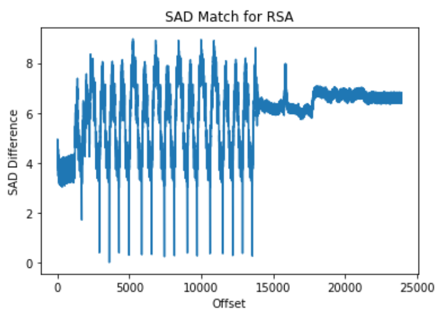  
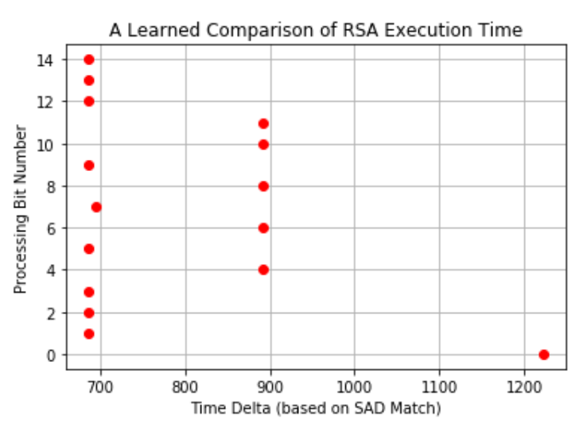  
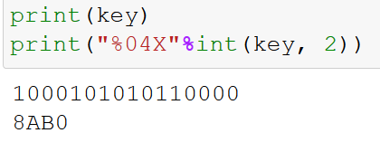  
For the ABE3 key:  
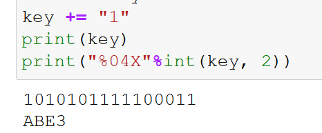 

__You were asked question about solving last bit of key, insert answer here__

```
To find the right key with the ABE3 key, we changed manually the last bit of the binary number of the key (as you can see on the picture above).  
This bit was fixed to 0 because we are not able to read it, so we need to adjust it according to the desired result.  
We can't get the last bit of the RSA key because in the for loop (last part of the code), we calculate the delta and for the last bit, delta is null so we can't have the last bit.  
```

# Task 3

## A) Introduction to clock glitch attacks

**Screenshots of successful glitching of the functions `glitch1()` and `glitch3()`**

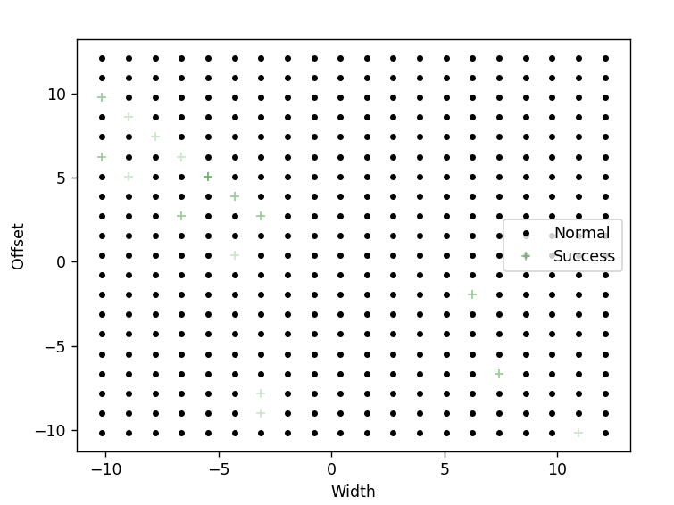
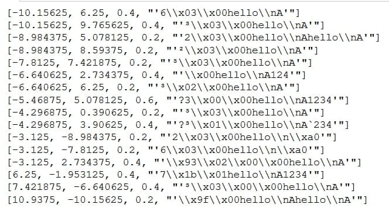  
Code changes:  
```python
if PLATFORM == "CW303" or PLATFORM == "CWLITEXMEGA":
    offset_range = Range(5.07, 5.08, 0.00001) 
    width_range = Range(-5.47, -5.45, 0.00001)
```
```python
for width in np.arange(width_range.min, width_range.max, width_range.step):
    scope.glitch.offset = offset_range.min
    for offset in np.arange(offset_range.min, offset_range.max, offset_range.step):
```
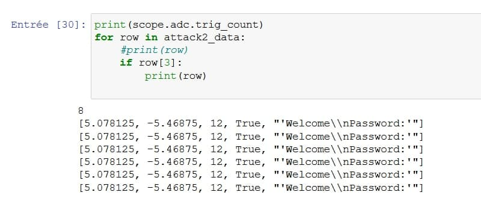

## B) Buffer glitch attack


**Paste the screenshot of successful glitch result here**

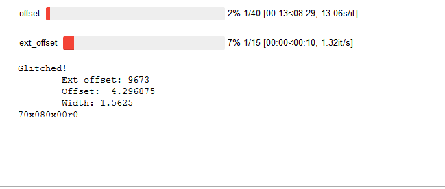
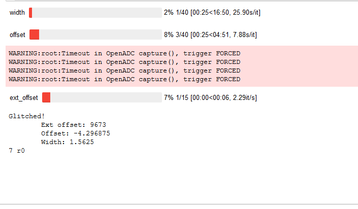
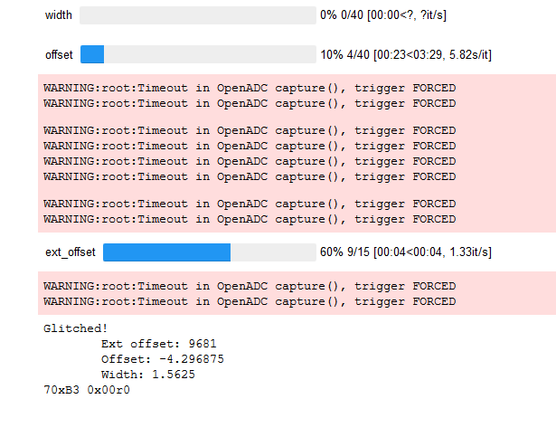

**Additional questions:**  
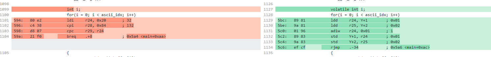
```
The volatile keyword indicates to a compiler that there could be external processes that could possibly alter the value of that variable. Without it, the variable would not always have the right value because it couldn't be updated. With the volatile keyword, we get always the latest value of the variable.  
The two codes are almost identical but the one with the volatile variable will work with the memory addresses instead of their values.  

We found a good description of the problem on the following link:  
https://stackoverflow.com/questions/1665452/volatile-variable
"volatile just tells the compiler or force the compiler to "not to do the optimization" for that variable. so compiler would not optimize the code for that variable and reading the value from the specified location, not through interal register which holds the previous value.

So, by declaring variable as volatile.. it gives garrantee that you will get the latest value, which may be alterred by an external event.

your code may be work fine if haven't declare that variable as volatile, but there may be chance of not getting correct value sometimes.. so to avoid that we should declare variable as volatile."
```

## C) Differential Fault Analysis on AES

**Paste screenshot of successful results here**

```
To do a Differential Fault Analysis attack, we inject some faults and we observe the difference between the correct output and the faulty outputs. We run several times the same AES encryption, with the same key and the same plaintext input. Then, by analyzing correct/faulty output pairs and comparing them, we can retrieve the cryptographic keys.  
To be able to succeed in the attack, we must find the right parameters (for the offset and the extoffset) for the clock glitches. 
```  
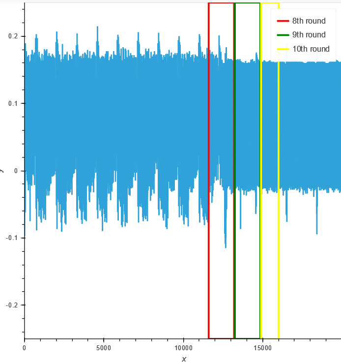  
```
We found that the extoffset must be done before the two MixColumn operations for the 8 and between the round 8 and 9 for the 9.  
So for the 9th round attack, we put this range: (13200, 13250) and for the 8th round, we put: (11000, 11500).  
For the 8th round, we found some true keys with an offset range of (-12, 12):  
```
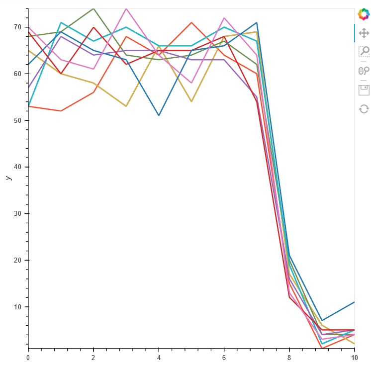  
```
There are some interesting keys but none was satisfactory.  
For the 9th round, we get always false keys.  
We tried many different offset ranges (larger, smaller, around zero, in negative or positive numbers,...) but none of them gave us the key to the different rounds (even with different extoffsets).  
The MixColumn operation is an important operation for AES which makes it safe, so it's for this reason that we attack round 8 and 9 and not round 10.  
The difference between the two attacks is that we don't attack at the same position: one before the two MixColumn operations (for the 8) and one between the 2 rounds (for the 9).  
Solving the round key is interesting because we can revert the AES keyscheduling and reveal the actual AES key.  
```


# Task 4

This tasks documentation varies depending on which versio you chose. Create your own documentation as you see fit. List here all the files that are part of your return  
<br>
**Option 1. Tutorials** 
## Task 4A
<br>
This attack differs from AES CPA attack. 
DPA (Differential Power Analysis) is used to recover the key used in the AES encryption, like CPA. But for DPA, it takes multiple traces of two sets of data, then computes the difference of the average of these traces. Then, we get the largest difference to find the best subkey, and it repeates these stages for each subkey.  
CPA, for its part, aims to reveal data leakage by finding relationships between characteristics of power traces and a hypothesised power model.  
A ghost peak is a peak that appears when evaluating incorrect key candidates. It's called like that it appears at an unexpected position.  
  
We can see the 5 firsts peaks. There are all spaced by 255.  
We changed the code so that we don't get any error. Indeed, we had an error because when running, it contunied after 1600 and so there was nothing after because the fifth peak (the yellow one) was at the beginning (with the right offset from the fourth one). We did these changed so that all the peaks will be found.  
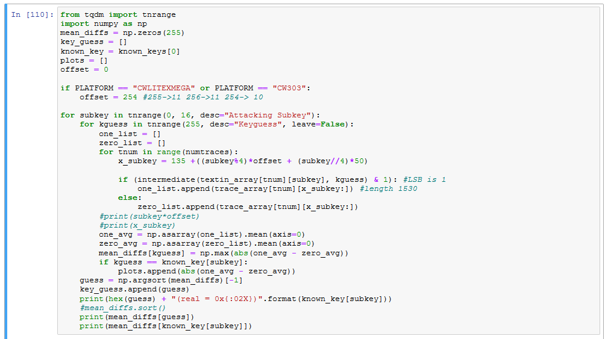  
We tried with different offsets (254, 255, 256) and we found that 11 subkeys were successful with 255 and 256 (only 10 with 254).  
This is the output with this code for an offset of 254:  
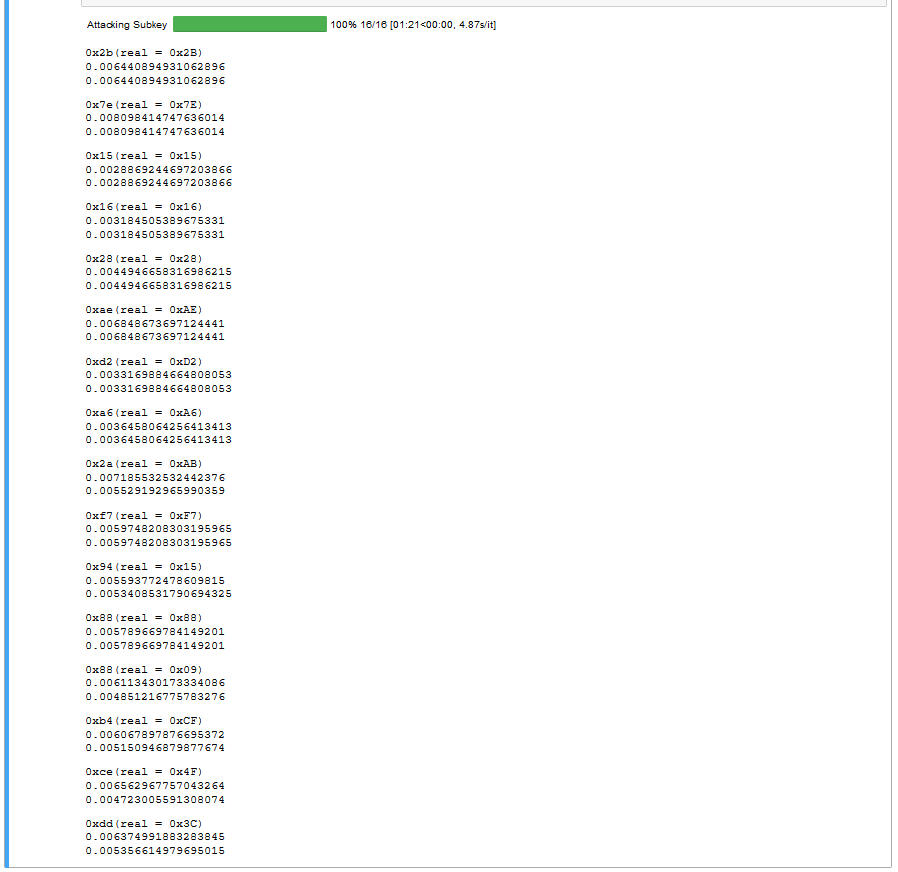  
So 7 subkeys were not found.  
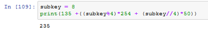  
For the nineth peak, we can see with our formula that we find 235. But according to the graph, this peak must be at 244.  
To get all the right subkeys, it could take some times to find the right formula and the right offset.  

## Task 4B
The template attack require more setup than CPA attacks. To perform a template attack, the attacker must have access to another copy of the protected device that they can fully control. This is why we captured many traces to create a copy of the system.  
To solve this task, we implemented following algorithms:  
```
capture 25k traces  
building a template based on these values by trying our own key bytes  
-> for each byte position, each bytes (0 to 255) * 16 (for key position)  
After this, we can used matrix for comparing the traces.  
Then compare each position on the power trace to find the right byte.  
```
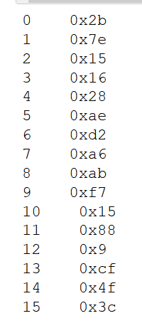  
The minimum amount of traces we need is just to get a good copy as more traces we captured as better the copy is we get.  
Sadly because  we lost so must time during setup (2 days) and the problem with task 3C we are not able to solve the last very well and we just can provide the idea of the algorithm and we can't implement it by our one. Maybe it could be helpful for future students to add the comments: USB 2 should be used but if you have access to USB 3 it's even more faster.  
It's recommended to use the PCs of the university because some PCs have problems with normally USB connection to the device.  
